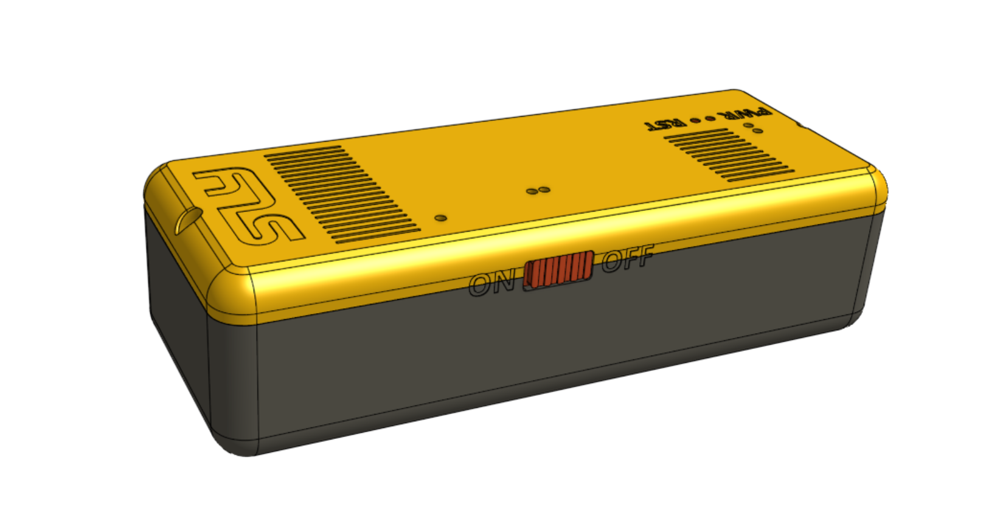
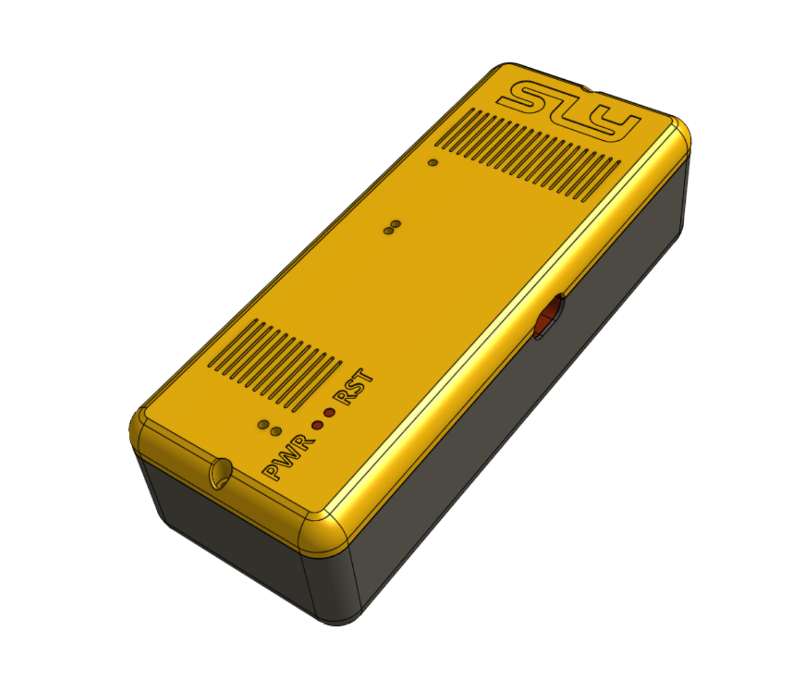
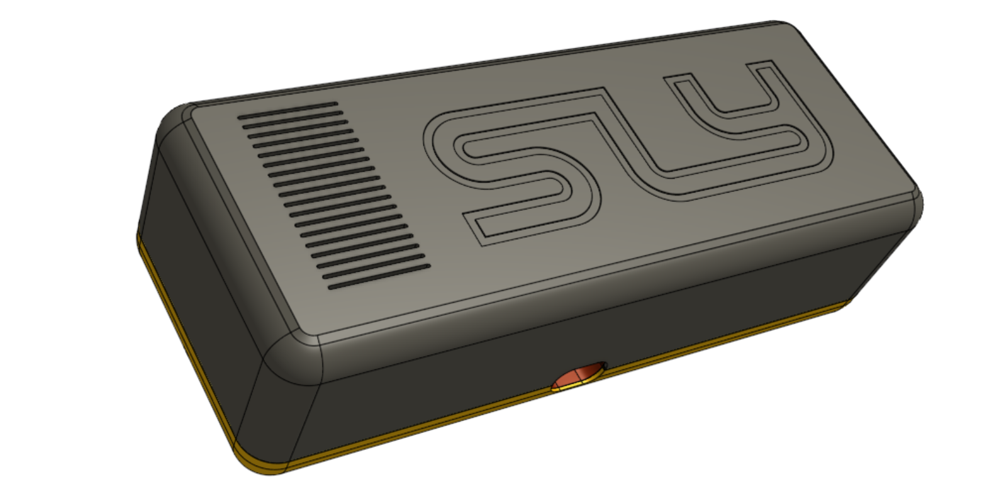
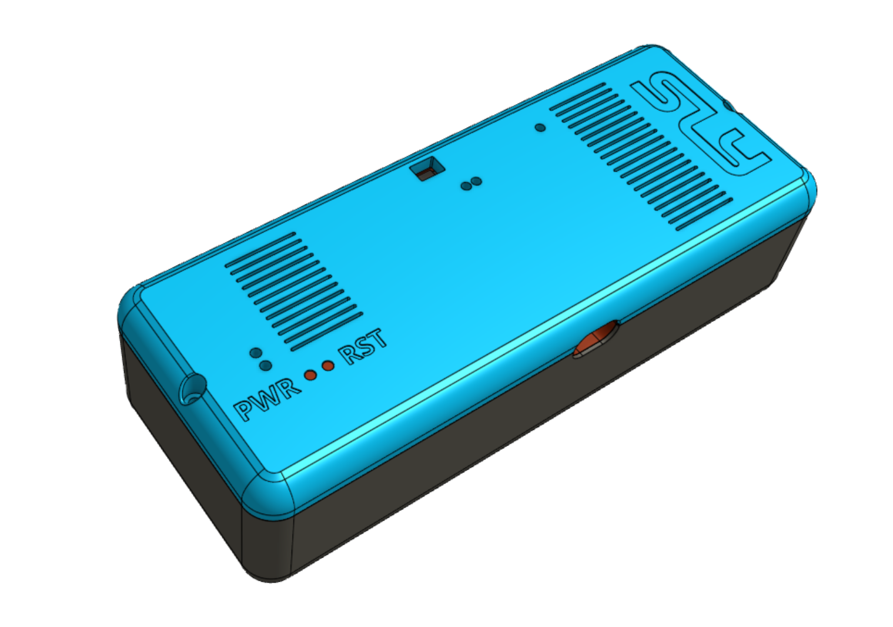
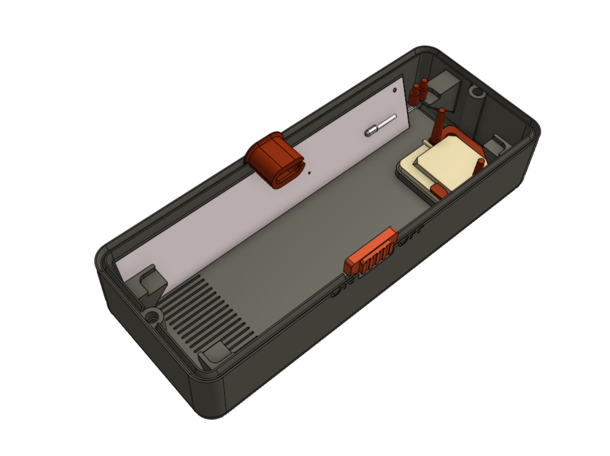
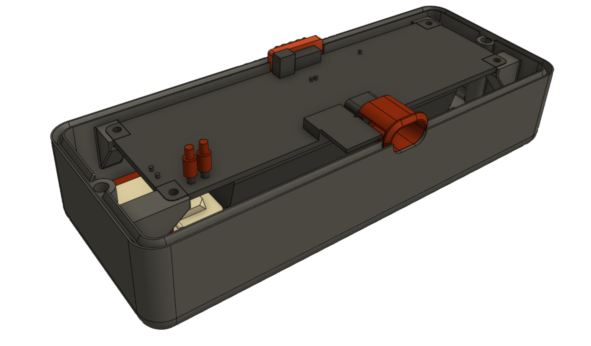

# MotoTracker

Multi-device GPS tracking dashboard — LilyGO T-SIM7000G (ESP32 + SIM7000G) firmware with live/batch tracking modes, SD offline buffer, and a PHP/MySQL/Leaflet web dashboard with per-device overlays, ride replay, stats, and GPX export.

Supports multiple GPS sources in one UI: the on-board firmware, any Traccar-tracked device (phone, ST-901L, etc.) via the Home Assistant integration, or any other client that POSTs to the HTTP ingest endpoint.

## Screenshots

### Web Dashboard


### LilyGO T-SIM7000G Module


### 3D-Printed Case


## Project Structure

```
├── firmware/
│   └── gps_tracker_optimized/   # Arduino sketch (v3) for LilyGO T-SIM7000G
│       ├── gps_tracker_optimized.ino
│       └── config.h             # Hardware pins, server, APN, API key
├── backend/                     # PHP/MySQL web dashboard (Apache)
│   ├── index.html               # Main SPA (Leaflet map + device picker + settings modal)
│   ├── admin.html               # Admin panel (users + devices tables, gated on is_admin)
│   ├── map.js                   # Map rendering, per-device overlays, replay, stats, device settings
│   ├── script.js                # Live auto-refresh
│   ├── style.css                # Dark theme styles
│   ├── gps_tracker_add_data_to_db.php  # Receive GPS points (device code → devices table)
│   ├── ingest_traccar.php       # Traccar Client / OsmAnd phone-push compatibility shim
│   ├── pobierz_urzadzenia.php   # List devices → JSON (populates the UI picker)
│   ├── pobierz_punkty.php       # Points for a date; single device or all → JSON
│   ├── pobierz_ostatni_punkt.php # Latest point(s) → JSON (live tracking)
│   ├── pobierz_historie.php     # Ride history grouped by device+date → JSON
│   ├── export_gpx.php           # Export a single device's ride as GPX
│   ├── distance_meausure.php    # Distance calculation helper
│   ├── auth.php                 # Session check + per-user device filter
│   ├── login.php / login.html   # Username+password login
│   ├── logout.php               # Session destroy
│   ├── change_password.php / change_password.html
│   ├── pobierz_me.php           # Current-user JSON (display name, admin flag, API key)
│   ├── device/                  # User-facing device management endpoints
│   │   ├── _common.php          # Ownership check + POST guard helpers
│   │   ├── update.php           # Rename device and/or change polyline color
│   │   └── delete_points.php    # Range delete (all / stationary-only) with FK cascade
│   ├── admin/                   # Admin-only endpoints (all require is_admin=1)
│   │   ├── _gate.php            # 403s non-admins; shared helpers
│   │   ├── list_users.php       # Users list with device + recent-activity counts
│   │   ├── list_devices.php     # Devices list with owner + last-point timestamp
│   │   ├── reset_password.php   # Force-reset a user's password (must_change_password=1)
│   │   ├── regen_api_key.php    # Rotate a user's write API key (old key dies instantly)
│   │   ├── regen_view_key.php   # Rotate a user's read-only embed token (for HA iframes etc.)
│   │   ├── toggle_user.php      # Soft-disable a user (refuses self-disable)
│   │   └── reassign_device.php  # Move a device to a different owner (keeps history)
│   ├── migrations/              # SQL migrations (run in order)
│   │   ├── 001_multi_device.sql # Single-table S_02 → devices + points schema
│   │   ├── 002_multi_user.sql   # users table + devices.user_id
│   │   ├── 003_point_source.sql # points.source ENUM + parent_id for snap/interpolate
│   │   ├── 004_admin.sql        # users.active for soft-disable
│   │   ├── 005_traccar_pull.sql # points.traccar_pos_id for pull idempotency
│   │   └── 006_read_api_key.sql # users.read_api_key for password-less embed (HA iframe)
│   ├── tools/
│   │   ├── bootstrap_admin.php  # Seed the first admin (preserves legacy API key)
│   │   └── add_user.php         # Create a user and mint a write API key
│   ├── gps_track_config.php.example  # DB credentials template
│   ├── composer.json            # PHP dependencies (google/protobuf)
│   ├── MULTI_USER_SETUP.md      # Runbook for malinka multi-user deploy
│   └── UBUNTU_STANDALONE.md     # Runbook for the public-facing ubuntu instance
├── integrations/
│   ├── malinka/                 # On-malinka workers (systemd timers)
│   │   ├── snap_interpolate.py  # OSRM /match + /route gap-fill; 5-min cadence
│   │   └── pull_from_traccar.py # Pull HA Traccar positions via REST; 2-min cadence
│   └── homeassistant/           # Legacy push-based integration (superseded by pull)
│       └── push-to-mototracker.py
├── hardware/
│   └── T-SIM7000G_Box_-_Box_PWR_Button.stl  # 3D-printable power button cap
├── tools/
│   └── gen_demo_ride.py         # Generate demo GPS data and insert into MySQL
└── img/                         # Screenshots for this README
```

## Hardware

| Component | Details |
|-----------|---------|
| Board | LilyGO T-SIM7000G (ESP32 + SIM7000G modem) |
| Cellular | 2G GSM / NB-IoT / CAT-M (no 4G) |
| GPS | Integrated SIM7000G GNSS, 1 Hz |
| SD card | Up to 32 GB (offline buffer) |
| Battery | 18650 Li-Ion with charging circuit |
| Power button | 3D-printed cap for the board's power switch |

## Firmware

Two tracking modes selectable in `config.h`:

### LIVE mode (`#define TRACKING_MODE_LIVE`)
- GPS + modem always on, sends 1 point/second via HTTP GET
- HTTP keep-alive reuses the TCP connection
- SD buffer on network failure, auto-recovers when connectivity returns
- Battery protection: auto-sleeps below 3.3 V
- LED: blink = sending, solid = no GPS fix

### BATCH mode (`#define TRACKING_MODE_BATCH`)
- Deep sleep 60 s between fixes, RTC memory batches 5 points per send
- SD offline buffer (up to 100 000 points ≈ 27 h at 1 pt/s)
- Low power consumption

### HTTP ingest protocol

```
GET /gpstrack/gps_tracker_add_data_to_db.php?k=<API_KEY>&v=<DEVICE_CODE>&la=<LAT>&lo=<LON>&s=<SPEED>&t=<TEMP>&h=<HUM>&b=<BAT>&ts=<TIMESTAMP>
```

| param | meaning |
|-------|---------|
| `k`   | write API key (matches `$gps_db_write_api_key`) |
| `v`   | device code (must exist in `devices.code` with `active=1`, e.g. `S_02`, `HA_6`) |
| `la`, `lo` | latitude, longitude (decimal degrees) |
| `s`   | speed (km/h) |
| `t`, `h`, `b` | temperature (°C), humidity (%), battery (V) |
| `ts`  | ISO/MySQL timestamp — optional; defaults to server time |

Short parameter names reduce transmission overhead over cellular. Unknown or inactive device codes are rejected.

### Setup

1. Open `firmware/gps_tracker_optimized/` in Arduino IDE.
2. Edit `config.h`: set `IOT_SERVER`, `API_KEY`, `apn`, and choose `TRACKING_MODE_LIVE` or `TRACKING_MODE_BATCH`.
3. Select board: **ESP32 Dev Module** (`esp32:esp32:esp32`).
4. Flash to LilyGO T-SIM7000G.

## Backend (Web Dashboard)

Self-hosted on a Raspberry Pi running Apache + PHP + MySQL.

**Features:**
- Leaflet map with device picker (select one device or "All devices")
- Single device → route coloured by speed (green → red), stats, replay
- All devices → each device drawn in its own solid colour with an endpoint marker
- Ride stats (single device): distance, duration, avg/max speed, temperature, battery
- Ride replay with adjustable speed slider (single device)
- Ride history grouped by device + date (last 200 rides)
- GPX export per device per day
- Live mode: auto-refreshes every 2 s when viewing today's ride

### Data model

Two tables, grown by migrations:

```sql
CREATE TABLE devices (
    id INT AUTO_INCREMENT PRIMARY KEY,
    code VARCHAR(64) NOT NULL UNIQUE,   -- used as `v` in the ingest URL
    name VARCHAR(128) NOT NULL,          -- shown in the UI picker
    color VARCHAR(16) NOT NULL DEFAULT '#3498db',
    active TINYINT(1) NOT NULL DEFAULT 1,
    user_id INT NOT NULL,                -- owning user (added by 002)
    created_at TIMESTAMP DEFAULT CURRENT_TIMESTAMP,
    FOREIGN KEY (user_id) REFERENCES users(id)
);

CREATE TABLE points (
    id INT AUTO_INCREMENT PRIMARY KEY,
    device_id INT NOT NULL,
    timestamp TIMESTAMP NOT NULL DEFAULT CURRENT_TIMESTAMP,
    lat DOUBLE NOT NULL,
    lon DOUBLE NOT NULL,
    speed DOUBLE,
    temperature DOUBLE,
    humidyty DOUBLE,
    battery DOUBLE,
    -- added by 003_point_source.sql (OSRM pipeline):
    source ENUM('raw','snapped','interpolated') NOT NULL DEFAULT 'raw',
    parent_id INT DEFAULT NULL,          -- interpolated children point at the raw row they came from
    -- added by 005_traccar_pull.sql (HA pull idempotency):
    traccar_pos_id BIGINT DEFAULT NULL,
    FOREIGN KEY (device_id) REFERENCES devices(id),
    INDEX idx_device_timestamp (device_id, timestamp),
    UNIQUE KEY uq_points_traccar (device_id, traccar_pos_id)
);
```

`source` drives the OSRM pipeline: freshly-ingested rows land as `raw`, the snap worker rewrites them to `snapped` once matched to a road geometry, and the interpolator inserts `interpolated` children with `parent_id` pointing at the raw row they were derived from. The UI and exports treat all three sources the same for display purposes; deletes cascade children via `parent_id` so cleaning a stretch of raw history also purges its interpolated fill. `traccar_pos_id` makes the Traccar puller idempotent: re-running the worker after a crash cannot double-insert.

### Setup

1. Copy `backend/` files to your web server root (e.g. `/var/www/html/gpstrack/`).
2. Copy `gps_track_config.php.example` → `gps_track_config.php` and fill in credentials.
3. Run `composer install` inside `backend/` (for `google/protobuf` — legacy, not required for current HTTP mode).
4. Create the MySQL database and apply the schema migration:

```bash
mysql -u root -e "CREATE DATABASE gps_db_data"
for f in backend/migrations/*.sql; do
    mysql -u root gps_db_data < "$f"
done
```

| migration | what it does |
|-----------|--------------|
| `001_multi_device.sql` | Creates `devices` + `points`, seeds default device `S_02` = `LilyGO Main`; if a legacy `S_02` table exists it migrates rows into `points` with `device_id=1` and renames the old one to `S_02_backup`. |
| `002_multi_user.sql` | Adds the `users` table and a nullable `devices.user_id`; the FK + NOT NULL are applied later by `bootstrap_admin.php` once every device has an owner. |
| `003_point_source.sql` | Adds `points.source` (`raw`/`snapped`/`interpolated`) and `points.parent_id` so the OSRM snap + route-interpolation workers can distinguish ingested rows from their road-matched fill. |
| `004_admin.sql` | Adds `users.active` for soft-disable; the admin panel uses this instead of deleting rows (so history is preserved). |
| `005_traccar_pull.sql` | Adds `points.traccar_pos_id` + a `UNIQUE(device_id, traccar_pos_id)` index so the malinka Traccar puller can dedup on re-run. |
| `006_read_api_key.sql` | Adds `users.read_api_key` (UNIQUE) — a per-user read-only embed token that grants password-less access to that user's read endpoints, used to drop the dashboard into a Home Assistant iframe without forcing a login. Existing users are auto-backfilled with a random key. |

5. Seed the first admin user:

```bash
cd backend && sudo -u www-data php tools/bootstrap_admin.php <username> <initial-password>
```

The bootstrap script reuses the legacy `$gps_db_write_api_key` from `gps_track_config.php` as the admin's write API key, so firmware and HA push keep working across the migration. The admin is flagged `must_change_password` and will be redirected to the change-password screen on first login.

6. Add more devices by inserting into the `devices` table (remember to set `user_id`):

```sql
INSERT INTO devices (code, name, color, user_id) VALUES
    ('MY_BIKE',  'Motorcycle', '#e74c3c', 1),
    ('MY_PHONE', 'Phone',      '#3498db', 1);
```

Admins see every active device; regular users only see rows where `devices.user_id` matches their user id.

### Adding more users

Each user has their own bcrypt-hashed password and a unique 32-char write API key. A user
always needs at least one device to track, so `add_user.php` provisions the user and their
first device atomically (in a single DB transaction — rollback on failure):

```bash
cd backend
# Usage: add_user.php <username> <password> <device_code> <device_name> [--color=#rrggbb] [--admin]
sudo -u www-data php tools/add_user.php alice hunter2 ALICE_BIKE "Alice's Bike" --color=#9b59b6
sudo -u www-data php tools/add_user.php bob   s3cret  BOB_CAR    "Bob's Car"    --admin
```

The script prints the generated write API key and the new device code — share both with the user so their firmware / phone client can authenticate.

To give an existing user an additional device:

```sql
INSERT INTO devices (code, name, color, active, user_id)
VALUES ('ALICE_CAR', 'Alice Car', '#2ecc71', 1, <alice_id>);
```

To hand over an admin-owned device to a user:

```sql
UPDATE devices SET user_id = <alice_id> WHERE code = 'ALICE_BIKE';
```

Write-ingest (`gps_tracker_add_data_to_db.php`) validates that the device's `user_id` matches the API key's owner (admins bypass this check), so leaking a per-user key cannot be used to write into another user's devices.

### Demo data

Generate a demo motorcycle ride and insert it into MySQL:

```bash
python3 tools/gen_demo_ride.py | mysql -u root gps_db_data
# Or directly to remote server:
python3 tools/gen_demo_ride.py | ssh user@server 'sudo mysql -u root gps_db_data'
```

Edit waypoints, date, and time at the top of the script. **Note:** `gen_demo_ride.py` predates the multi-device refactor and still emits inserts against a flat table. Update its output to target the `points` table with a `device_id`, or insert into a temporary table and copy over with a `SELECT <device_id>, …` INSERT.

## Home Assistant / Traccar integration

On the malinka deployment, phones and OBD trackers send their positions to the Home Assistant Traccar add-on, and a pair of workers on the MotoTracker host (`integrations/malinka/`) pull and road-snap those positions into the MotoTracker database. Every Traccar device automatically gets a matching MotoTracker device the first time it's seen.

Two workers, both driven by systemd timers:

- `pull_from_traccar.py` — 2-minute cadence; hits Traccar's REST API, auto-creates missing MotoTracker devices, and INSERTs raw rows.
- `snap_interpolate.py` — 5-minute cadence; flips `source` from `raw` → `snapped` via OSRM `/match` and fills road-sampled `interpolated` children between consecutive fixes via OSRM `/route`.

The 2-min / 5-min offset is deliberate: raw rows land before the next snap pass so interpolation always has something to work on.

### How the pull worker works

1. Logs in to Traccar with `POST /api/session` (cookie-based auth; a quoted `TRACCAR_PASSWORD` env var avoids shell-interpolation surprises for passwords containing `$`, `#`, `;`, etc.).
2. Fetches `/api/devices` and calls `ensure_device()` for each — `INSERT … ON DUPLICATE KEY UPDATE id = LAST_INSERT_ID(id)` atomically resolves the MotoTracker device id and creates missing rows as `HA_<traccar_id>` owned by the first admin.
3. For each device, fetches `/api/positions?deviceId&from&to` across a small lookback window (default 10 min), converts speed from knots to km/h (× 1.852), and `INSERT IGNORE INTO points (…, source='raw', traccar_pos_id=…)` — the unique index makes re-runs safe after a crash or network blip.

### How the snap/interpolate worker works

1. Loads recent `source='raw'` rows in per-device batches (default 100 positions) and POSTs them to OSRM `/match` with timestamps (`annotations=false&gaps=split&tidy=true`). Successfully-matched coordinates replace the raw lat/lon and the row is flipped to `source='snapped'`.
2. Walks consecutive snapped pairs; when the gap sits between `MIN_GAP_M` (40 m) and `MAX_GAP_M` (5 km), it calls OSRM `/route` and inserts up to `MAX_POINTS_PER_GAP` (10) sampled points at `POINT_SPACING_M` (25 m) between them as `source='interpolated'` with `parent_id` pointing at the *second* raw row of the pair. Routes whose distance is more than `MAX_ROUTE_RATIO` (3×) the straight-line gap are skipped as nonsense.
3. Interpolated rows never become parents themselves, so the graph stays shallow and `DELETE … JOIN points p ON p.id = c.parent_id` cleanly cascades one level.

### Setup (malinka side)

1. Copy the workers to `/opt/mototracker/` and make them executable. Install their only runtime deps:

   ```bash
   sudo apt install python3-requests python3-pymysql
   sudo mkdir -p /opt/mototracker /etc/mototracker
   sudo cp integrations/malinka/*.py /opt/mototracker/
   ```

2. Write env files (keep them `root:www-data 0640`, and **single-quote any password containing shell metacharacters**):

   ```ini
   # /etc/mototracker/traccar.env
   TRACCAR_URL=http://192.168.1.142:8082
   TRACCAR_EMAIL=you@example.com
   TRACCAR_PASSWORD='<your-traccar-password>'
   DB_HOST=localhost
   DB_USER=gps_db_user
   DB_PASS='<your-db-password>'
   DB_NAME=gps_db_data
   ```

   ```ini
   # /etc/mototracker/snap.env
   OSRM_URL=http://192.168.1.142:5001        # HA OSRM add-on
   DB_HOST=localhost
   DB_USER=gps_db_user
   DB_PASS='<your-db-password>'
   DB_NAME=gps_db_data
   ```

3. Create matching systemd units (oneshot + timer) for each worker. A minimal pattern:

   ```ini
   # /etc/systemd/system/pull-from-traccar.service
   [Service]
   Type=oneshot
   User=www-data
   EnvironmentFile=/etc/mototracker/traccar.env
   ExecStart=/usr/bin/python3 /opt/mototracker/pull_from_traccar.py

   # /etc/systemd/system/pull-from-traccar.timer
   [Timer]
   OnBootSec=30s
   OnUnitActiveSec=2min
   AccuracySec=10s
   [Install]
   WantedBy=timers.target
   ```

   Same shape for `snap-interpolate.{service,timer}` with `OnUnitActiveSec=5min`.

4. Enable the timers and verify:

   ```bash
   sudo systemctl enable --now pull-from-traccar.timer snap-interpolate.timer
   journalctl -u pull-from-traccar.service -n 50
   mysql gps_db_data -e "SELECT d.code, p.source, COUNT(*) FROM points p
       JOIN devices d ON p.device_id=d.id
       WHERE DATE(p.timestamp)=CURDATE()
       GROUP BY d.id, p.source"
   ```

### Configuration reference (pull worker)

| env var | default | purpose |
|---------|---------|---------|
| `TRACCAR_URL` | — | Base URL of the Traccar instance (e.g. `http://192.168.1.142:8082`) |
| `TRACCAR_EMAIL` / `TRACCAR_PASSWORD` | — | Traccar login; password must be single-quoted in the env file |
| `LOOKBACK_MINUTES` | `10` | How far back to scan `/api/positions` each run |
| `DEVICE_PREFIX` | `HA_` | Prefix used when auto-creating MotoTracker devices for new Traccar ids |
| `DB_HOST` / `DB_USER` / `DB_PASS` / `DB_NAME` | — | MotoTracker database connection |

### Configuration reference (snap/interpolate worker)

| env var | default | purpose |
|---------|---------|---------|
| `OSRM_URL` | — | OSRM base URL (HA add-on typically on port 5001) |
| `MATCH_BATCH_SIZE` | `100` | Positions per `/match` request |
| `MIN_GAP_M` / `MAX_GAP_M` | `40` / `5000` | Gap range eligible for interpolation fill |
| `POINT_SPACING_M` | `25` | Target spacing of interpolated children along the route |
| `MAX_POINTS_PER_GAP` | `10` | Cap on interpolated children per pair |
| `MAX_ROUTE_RATIO` | `3.0` | Skip `/route` results whose distance > ratio × straight-line gap |

### Legacy push integration

`integrations/homeassistant/push-to-mototracker.py` is the older push-based approach that ran on Home Assistant and forwarded rows from Traccar's database out to MotoTracker's HTTP ingest. It's superseded by the pull architecture above — kept in-tree for reference only — and will not work against the HA Traccar add-on, whose embedded H2 database is not reachable from outside the container.

## Device management

Each device has a cog button in the top bar (visible when the owner is viewing their own device) that opens a two-tab modal:

- **Info** — rename the device (1..128 chars) and pick the polyline colour (`#rrggbb`). Changes apply on the next map load.
- **Cleanup** — delete points in a date range, either everything or just stationary jitter (`speed IS NULL OR speed < 1 km/h`). The delete cascades to interpolated children via `parent_id` in a transaction, so a partial failure rolls back cleanly.

Endpoints live under `backend/device/`:

| endpoint | purpose |
|----------|---------|
| `POST device/update.php` | `device_id`, optional `name`, optional `color`. Validates both; an empty body is rejected. |
| `POST device/delete_points.php` | `device_id`, `from`, `to` (date or datetime), `filter=all|stationary`. Date-only inputs expand to start/end-of-day. |

Both endpoints share `_common.php`, which enforces `POST` and calls `dev_load_owned()` — regular users get a 403 on devices they don't own; admins bypass the ownership check and can clean up anyone's history.

## Admin panel

`backend/admin.html` (linked from the top bar when `is_admin=1`) exposes a users table and a devices table with these actions, backed by `backend/admin/`:

- **Reset password** — forces `must_change_password=1`; the user is redirected to the change-password screen on next login.
- **Rotate API key** — mints a new 32-char `write_api_key`; the previous key stops working instantly. Admins rotating their own key *must* also update `gps_track_config.php`'s legacy `$gps_db_write_api_key` or the firmware will be rejected.
- **View token** — shows the user's read-only `read_api_key` and a ready-to-paste embed URL (`index.html?token=...`); a *Regenerate* button rotates the key, invalidating the old one immediately. See [Embedding read-only in Home Assistant](#embedding-read-only-in-home-assistant) below.
- **Toggle user** — soft-disables via `users.active=0`; refuses self-disable so you can't lock yourself out.
- **Reassign device** — moves `devices.user_id` to a different owner without touching history; the new owner inherits all past points.

Every endpoint is gated by `admin/_gate.php`, which returns 403 unless the session user has `is_admin=1`. Read-only embed tokens (see below) **never** reach the admin surface, even if the token belongs to an admin.

## Embedding read-only in Home Assistant

The dashboard supports a password-less, read-only mode for embedding in iframes
(e.g. a Home Assistant `webpage` Lovelace card). It is keyed off a per-user
`read_api_key` rather than session cookies, so it survives across browser
sessions, works inside iframes that block third-party cookies, and can be
revoked instantly without touching the user's password.

Generate / reveal the token in the admin panel: User row → **View token** →
copy the suggested embed URL.

```
http://<host>/gpstrack/index.html?token=<read_api_key>
```

When `index.html` is loaded with `?token=…`, `map.js` stashes the token in
`sessionStorage` and appends it to every backend request. In token mode the
UI hides logout, the admin link, and the device-settings modal, and 401s do
**not** redirect to `login.html` (which would loop inside an iframe).

What the token can and cannot do:

| | session login | `?token=…` embed |
|---|---|---|
| `pobierz_*.php`, `export_gpx.php` (read) | yes | yes |
| `device/update.php`, `device/delete_points.php` | yes | **403 read_only_token** |
| `change_password.php` | yes | **403** |
| anything under `admin/` | only if `is_admin=1` | **403** |
| device filter scope | admins see all, users see own | always scoped to the token's user, even for admin tokens |

Implementation: `auth.php` accepts the token via `?token=…` or
`Authorization: Bearer …`, looks it up against `users.read_api_key`, sets
`$auth_readonly = true`, and exposes an `auth_require_write()` helper that
mutating endpoints call to bail out with `403 read_only_token`.

## 3D Case

Custom enclosure for the LilyGO T-SIM7000G board with a power button. Print in PLA or PETG.

Model: [T-SIM7000G Box on Thingiverse](https://www.thingiverse.com/thing:5861376)

| | |
|---|---|
|  |  |
|  |  |
|  |  |

## Hardware Documentation

LilyGO T-SIM7000G official documentation, schematics, examples, and 3D files:
[github.com/Xinyuan-LilyGO/LilyGO-T-SIM7000G](https://github.com/Xinyuan-LilyGO/LilyGO-T-SIM7000G)

## Dependencies

**Firmware (Arduino libraries):**
- [TinyGSM](https://github.com/vshymanskyy/TinyGSM)
- [ArduinoHttpClient](https://github.com/arduino-libraries/ArduinoHttpClient)

**Backend:**
- [Leaflet.js](https://leafletjs.com/) 1.9.4 (CDN)
- [Font Awesome](https://fontawesome.com/) 6.5 (CDN)
- PHP 7.4+, MySQL 5.7+
