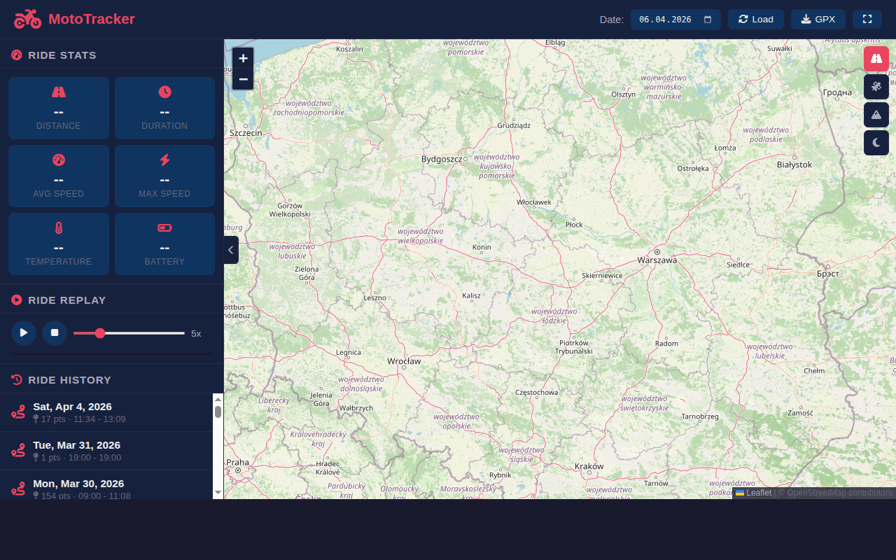
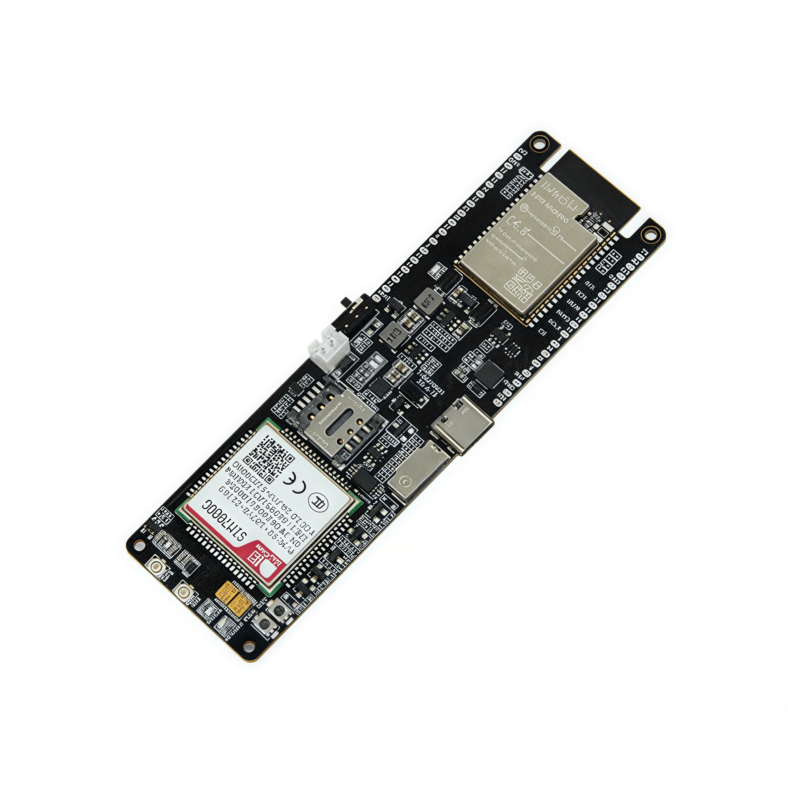

# MotoTracker

Motorcycle GPS tracker — LilyGO T-SIM7000G (ESP32 + SIM7000G) firmware with live/batch tracking modes, SD offline buffer, and a PHP/MySQL/Leaflet web dashboard with ride replay, stats, and GPX export.

## Screenshots

### Web Dashboard


### LilyGO T-SIM7000G Module


### 3D-Printed Case


## Project Structure

```
├── firmware/
│   └── gps_tracker_optimized/   # Arduino sketch (v3) for LilyGO T-SIM7000G
│       ├── gps_tracker_optimized.ino
│       └── config.h             # Hardware pins, server, APN, API key
├── backend/                     # PHP/MySQL web dashboard (Apache on Raspberry Pi)
│   ├── index.html               # Main SPA (Leaflet map)
│   ├── map.js                   # Map rendering, ride replay, stats
│   ├── script.js                # Live auto-refresh
│   ├── style.css                # Dark theme styles
│   ├── gps_tracker_add_data_to_db.php  # Receive GPS points from device
│   ├── pobierz_punkty.php       # Fetch all points for a date → JSON
│   ├── pobierz_ostatni_punkt.php # Fetch latest point → JSON (live tracking)
│   ├── pobierz_historie.php     # Fetch ride history list → JSON
│   ├── export_gpx.php           # Export ride as GPX file
│   ├── distance_meausure.php    # Distance calculation helper
│   ├── gps_track_config.php.example  # DB credentials template
│   └── composer.json            # PHP dependencies (google/protobuf)
├── hardware/
│   └── T-SIM7000G_Box_-_Box_PWR_Button.stl  # 3D-printable power button cap
├── tools/
│   └── gen_demo_ride.py         # Generate demo GPS data and insert into MySQL
└── img/                         # Screenshots for this README
```

## Hardware

| Component | Details |
|-----------|---------|
| Board | LilyGO T-SIM7000G (ESP32 + SIM7000G modem) |
| Cellular | 2G GSM / NB-IoT / CAT-M (no 4G) |
| GPS | Integrated SIM7000G GNSS, 1 Hz |
| SD card | Up to 32 GB (offline buffer) |
| Battery | 18650 Li-Ion with charging circuit |
| Power button | 3D-printed cap for the board's power switch |

## Firmware

Two tracking modes selectable in `config.h`:

### LIVE mode (`#define TRACKING_MODE_LIVE`)
- GPS + modem always on, sends 1 point/second via HTTP GET
- HTTP keep-alive reuses the TCP connection
- SD buffer on network failure, auto-recovers when connectivity returns
- Battery protection: auto-sleeps below 3.3 V
- LED: blink = sending, solid = no GPS fix

### BATCH mode (`#define TRACKING_MODE_BATCH`)
- Deep sleep 60 s between fixes, RTC memory batches 5 points per send
- SD offline buffer (up to 100 000 points ≈ 27 h at 1 pt/s)
- Low power consumption

### HTTP protocol

```
GET /gpstrack/gps_tracker_add_data_to_db.php?k=<API_KEY>&v=<TABLE>&la=<LAT>&lo=<LON>&s=<SPEED>&t=<TEMP>&h=<HUM>&b=<BAT>&ts=<TIMESTAMP>
```

Short parameter names reduce transmission overhead over cellular.

### Setup

1. Open `firmware/gps_tracker_optimized/` in Arduino IDE.
2. Edit `config.h`: set `IOT_SERVER`, `API_KEY`, `apn`, and choose `TRACKING_MODE_LIVE` or `TRACKING_MODE_BATCH`.
3. Select board: **ESP32 Dev Module** (`esp32:esp32:esp32`).
4. Flash to LilyGO T-SIM7000G.

## Backend (Web Dashboard)

Self-hosted on a Raspberry Pi running Apache + PHP + MySQL.

**Features:**
- Leaflet map with colored route (green → red by speed)
- Ride stats: distance, duration, avg/max speed, temperature, battery
- Ride replay with adjustable speed slider
- Ride history list (last 50 rides)
- GPX export per day
- Live mode: auto-refreshes every 2 s when viewing today's ride

### Setup

1. Copy `backend/` files to your web server root (e.g. `/var/www/html/gpstrack/`).
2. Copy `gps_track_config.php.example` → `gps_track_config.php` and fill in credentials.
3. Run `composer install` inside `backend/` (for `google/protobuf` — legacy, not required for current HTTP mode).
4. Create the MySQL database and table:

```sql
CREATE DATABASE gps_db_data;
USE gps_db_data;
CREATE TABLE S_02 (
    id INT AUTO_INCREMENT PRIMARY KEY,
    timestamp DATETIME DEFAULT CURRENT_TIMESTAMP,
    lat DOUBLE,
    lon DOUBLE,
    speed FLOAT,
    temperature FLOAT,
    humidyty FLOAT,
    battery FLOAT,
    INDEX idx_timestamp (timestamp)
);
```

### Demo data

Generate a demo motorcycle ride and insert it into MySQL:

```bash
python3 tools/gen_demo_ride.py | mysql -u root gps_db_data
# Or directly to remote server:
python3 tools/gen_demo_ride.py | ssh user@server 'sudo mysql -u root gps_db_data'
```

Edit waypoints, date, and time at the top of the script.

## 3D Case

`hardware/T-SIM7000G_Box_-_Box_PWR_Button.stl` — a 3D-printable power button cap that fits over the LilyGO T-SIM7000G board's power switch and passes through a custom enclosure lid. Print in PLA or PETG.

## Hardware Documentation

LilyGO T-SIM7000G official documentation, schematics, examples, and 3D files:
[github.com/Xinyuan-LilyGO/LilyGO-T-SIM7000G](https://github.com/Xinyuan-LilyGO/LilyGO-T-SIM7000G)

## Dependencies

**Firmware (Arduino libraries):**
- [TinyGSM](https://github.com/vshymanskyy/TinyGSM)
- [ArduinoHttpClient](https://github.com/arduino-libraries/ArduinoHttpClient)

**Backend:**
- [Leaflet.js](https://leafletjs.com/) 1.9.4 (CDN)
- [Font Awesome](https://fontawesome.com/) 6.5 (CDN)
- PHP 7.4+, MySQL 5.7+
